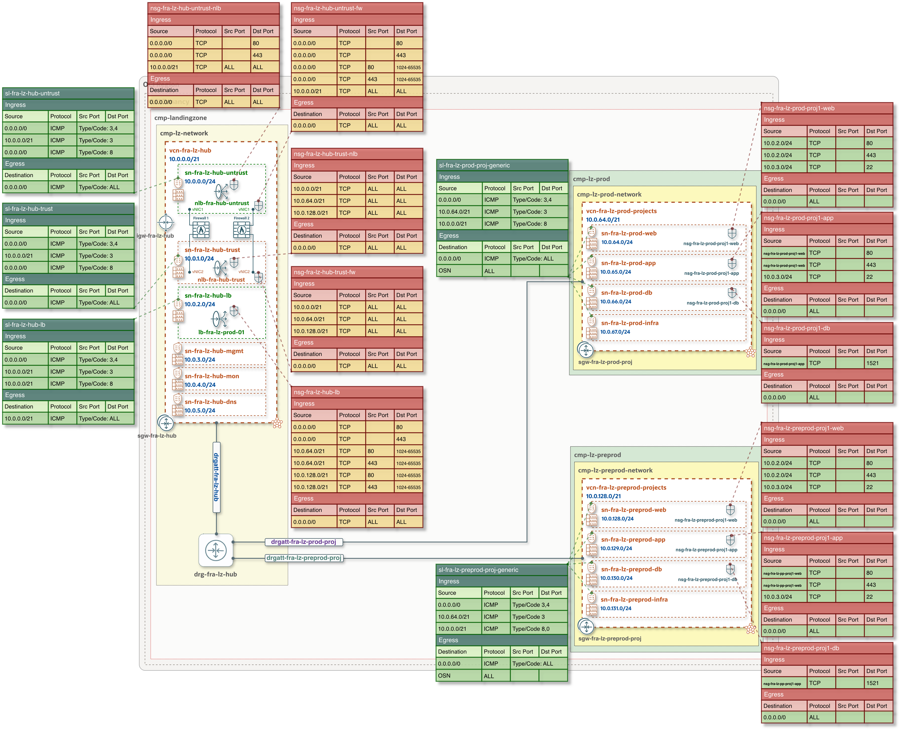

## **[Security Lists and Network Security Groups](#)**
### Overview
This document describes the exact Security List (SL) and Network Security Group (NSG) configuration defined in the One-OE Landing Zone JSON templates. The SL and NSG rules provide the minimum network access required by the supported deployment models, following the principle of least privilege.

Within the Hub VCN, the NSGs associated with OCI Network Firewall and Load Balancers are configured with stateless rules. This follows Oracle’s recommendation to use stateless rules for subnets with high traffic volumes, helping avoid the connection-tracking limitations associated with stateful rules.

For additional information, refer to: [Stateful compared to Stateless rules](https://docs.oracle.com/en-us/iaas/Content/Network/Concepts/securityrules.htm#stateful)

&nbsp;

#### The diagram represents the exact configuration of the Security List and Network Security Group rules for the [One-OE + Hub A deployment](https://github.com/oci-landing-zones/oci-landing-zone-operating-entities/blob/master/blueprints/one-oe/runtime/one-stack/one_oe_hub_a.md)

Important information and considerations in regards to SL and NSG configuration:
- Stateless rules are configured on NSGs associated with Network Firewalls and Load Balancer inside a Hub VCN. So if it's expected to have high traffic volumes on the specific subnets (e.g. inside Spoke VCN), it's recomended to make adjustment accordingly, changing stateful rules to the stateless. 
- If both stateful and stateless rules are used, and some traffic matches both a stateful and stateless rule in a particular direction (for example, ingress), the stateless rule takes precedence and the connection isn't tracked. You would need a corresponding rule in the other direction (for example, egress, either stateless or stateful) for the response traffic to be allowed.
- For the stateless rules make sure to allow and configure respective rules with ephemeral ports (10.24-65535) for return network flow, for example: Ingress, Protocol TCP, Source 0.0.0.0/0, Src port 80 Dst port 1024-65535.

&nbsp;

> [!IMPORTANT]

&nbsp;

&nbsp;

&nbsp;

> [!NOTE]
> 

&nbsp;
&nbsp;

#### Reference:
- [Oracle Cloud Infrastructure Documentation - Security Zone Policies](https://docs.oracle.com/en-us/iaas/Content/security-zone/using/security-zone-policies.htm)

&nbsp;

# License 

Copyright (c) 2026 Oracle and/or its affiliates.

Licensed under the Universal Permissive License (UPL), Version 1.0.

See [LICENSE](/LICENSE.txt) for more details.
